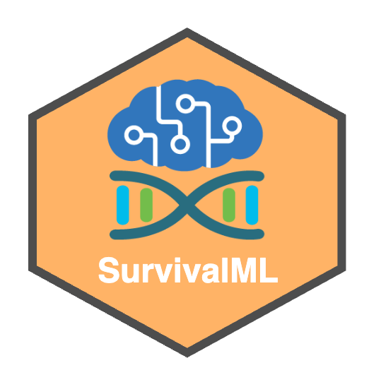
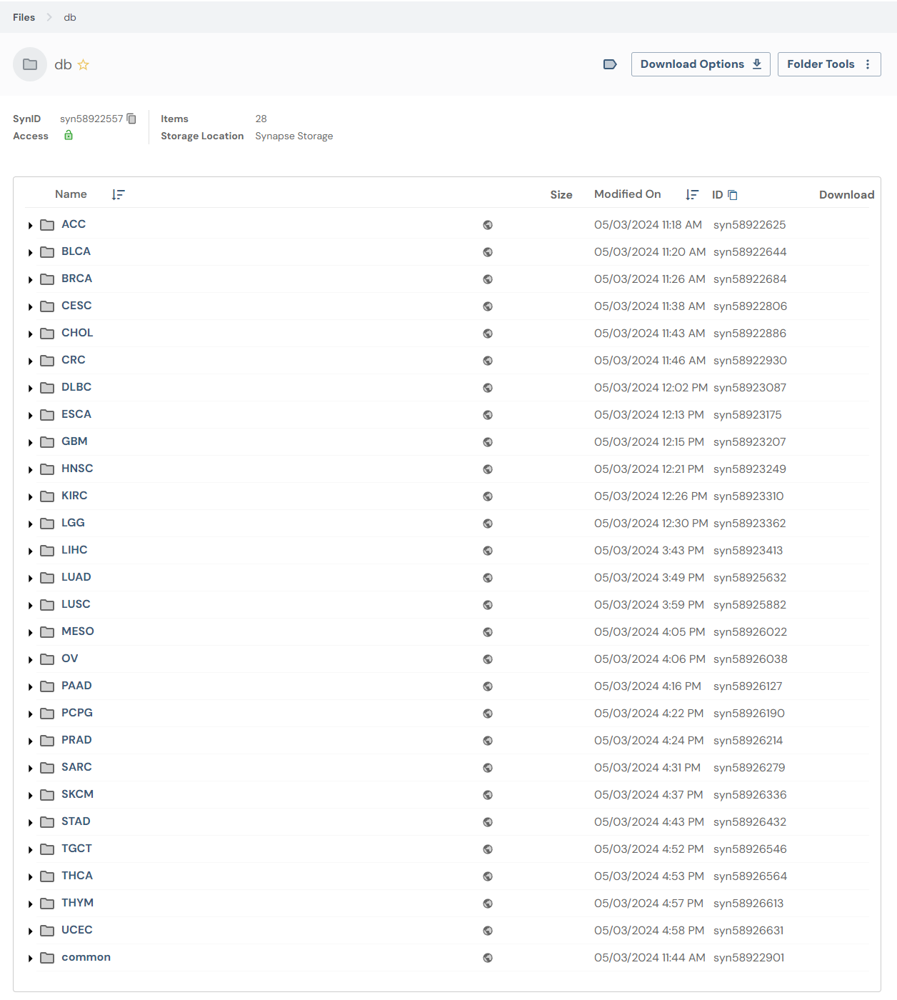
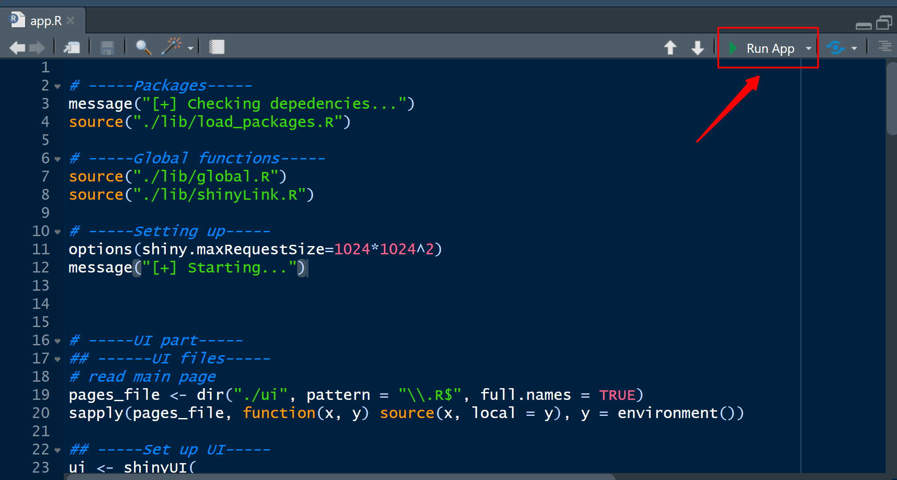
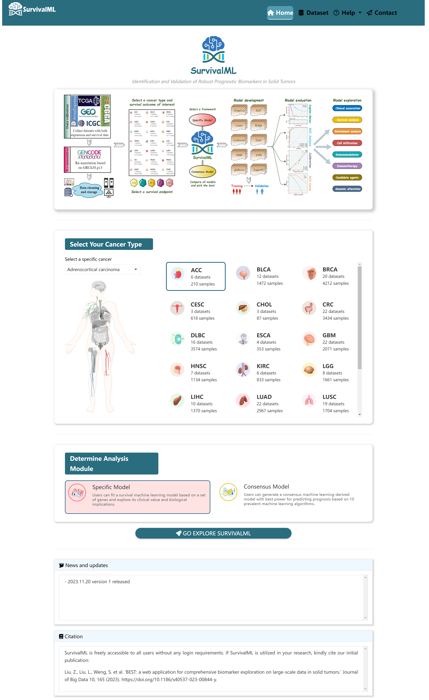

# 🚀 Survival Machine Learning 

<!-- badges: start -->
[](https://github.com/Zaoqu-Liu/SurvivalML/)
[](https://hits.seeyoufarm.com)
[](https://github.com/Zaoqu-Liu/SurvivalML?tab=GPL-3.0-1-ov-file)
[](https://github.com/Zaoqu-Liu/SurvivalML)
[](liuzaoqu@163.com)
<!-- badges: end -->

## 📊 Overview
**Efficient Discovery of Robust Prognostic Biomarkers and Signatures in Solid Tumors**  

🚀 **SurvivalML** provides an advanced framework for identifying prognostic biomarkers and signatures in solid tumors. 

🔍 **Introduction:**

Recent advancements in multi-omics and big-data technologies have facilitated the discovery of numerous cancer prognostic biomarkers and gene signatures. However, their clinical application remains limited due to poor reproducibility and insufficient independent validation. Despite the availability of high-quality datasets, achieving reliable biomarker identification across multiple cohorts continues to be a significant challenge. To address these issues, we developed a comprehensive platform, SurvivalML, designed to support the discovery and validation of prognostic biomarkers and gene signatures using large-scale and harmonized data from 21 cancer types.

---

## 🔗 **Preparation**
### 📥 Download the Data
🔹 **You can download the dataset for SurvivalML here:**  
📂 [**SurvivalML Dataset on Synapse**](https://www.synapse.org/#!Synapse:syn58922557)  

📌 **After downloading, move the `raw_data` folder into the `db` directory of the SurvivalML project.**  

<p align="center">

</p>

---

## ⚙️ **Environment Configuration**
Before running **SurvivalML**, ensure that the required **R packages** are installed.  

```r
## Set package repositories
options(BioC_mirror="https://mirrors.tuna.tsinghua.edu.cn/bioconductor")
options(repos=structure(c(CRAN="https://mirrors.tuna.tsinghua.edu.cn/CRAN/")))

message("[++] Initializing package installation...")

## Install pacman for package management
if (!requireNamespace("pacman")) install.packages("pacman")
library(pacman)

## Install devtools
if (!requireNamespace("devtools")) install.packages("devtools")
library(devtools)

## Install packages from GitHub
if (!requireNamespace("ComplexHeatmap")) {
  message("[++] Installing ComplexHeatmap")
  tryCatch(
    devtools::install_github("jokergoo/ComplexHeatmap"),
    error = function(e) message("[!!] ERROR: Cannot install [ComplexHeatmap]")
  )
}
library(ComplexHeatmap)

if (!requireNamespace("summaryBox")) {
  message("[++] Installing summaryBox")
  tryCatch(
    devtools::install_github("deepanshu88/summaryBox"),
    error = function(e) message("[!!] ERROR: Cannot install [summaryBox]")
  )
}
library(summaryBox)

if (!requireNamespace("bsplus")) {
  message("[++] Installing bsplus")
  tryCatch(
    devtools::install_github("ijlyttle/bsplus"),
    error = function(e) message("[!!] ERROR: Cannot install [bsplus]")
  )
}
library(bsplus)

## Install required CRAN and Bioconductor packages
pkgs <- c(
  "shiny", "shinyjs", "bslib", "waiter", "openxlsx", "plotly", "ggplot2", "stringr",
  "slickR", "shinyvalidate", "markdown", "bs4Dash", "DT", "shinyWidgets", "readr",
  "GetoptLong", "gplots", "shinyFeedback", "patchwork", "cowplot", "ggsci", "tidyverse",
  "RColorBrewer", "ggpubr", "BiocParallel", "shinypop", "remotes"
)

pacman::p_load(char = pkgs, install = TRUE)

## Install machine learning and survival analysis packages
devtools::install_github("Github-Yilei/ggcor")
pacman::p_load("circlize", "ggridges", "RobustRankAggreg", "org.Hs.eg.db", "GSVA",
               "survminer", "pROC", "WGCNA", "randomForestSRC", "glmnet", "gbm",
               "survivalsvm", "plsRcox", "RSpectra", "rARPACK", "mixOmics",
               "survcomp", "superpc", "timeROC", "rms", "dcurves", "snowfall")

## Install additional survival models
devtools::install_github("binderh/CoxBoost")
```

---

## ▶️ **Running the App**
Launch the **SurvivalML** Shiny app using the following command:  

```r
# Load dependencies
message("[+] Loading dependencies...")
source("./lib/load_packages.R")

# Load global functions
source("./lib/global.R")
source("./lib/shinyLink.R")

# Start Shiny application
shiny::shinyApp(
  ui = ui,
  server = server
)
```

<p align="center">

</p>

---

## 📌 **Start Exploring**
<p align="center">

</p>

🚀 **Ready to unlock the potential of survival machine learning?**  
**Let's start exploring prognostic biomarkers and survival prediction!**  

---


### 📖 **Citation**  

If you find **SurvivalML** useful, please cite the following publication:

> **Liu Z, Deng J, Xu H, et al.**  
> **Efficient Discovery of Robust Prognostic Biomarkers and Signatures in Solid Tumors.**  
> *Cancer Letters.* Published online **January 24, 2025**.  
> [https://doi.org/10.1016/j.canlet.2025.217502](https://doi.org/10.1016/j.canlet.2025.217502)  

### 🔖 **BibTeX Reference**
```bibtex
@article{Liu2025SurvivalML,
  author    = {Liu Z and Deng J and Xu H and others},
  title     = {Efficient Discovery of Robust Prognostic Biomarkers and Signatures in Solid Tumors},
  journal   = {Cancer Letters},
  year      = {2025},
  month     = {January},
  doi       = {10.1016/j.canlet.2025.217502},
  url       = {https://doi.org/10.1016/j.canlet.2025.217502}
}
```

### ✨ **How to Cite?**
You can cite this work in your research using the following BibTeX entry.

---

## ⭐ **Support & Feedback**
🔹 **Star this repo** if you find it useful! ⭐  
🔹 **Open an issue** if you have any questions or suggestions! 🛠  
🔹 **Contact me:** 📩 [liuzaoqu@163.com](mailto:liuzaoqu@163.com)  
