# 生存研究项目安装方法

## 1. 必须下载的基础软件

### 1.1 R语言
- 各版本的下载地址：[https://cran.r-project.org/bin/windows/base/old/](https://cran.r-project.org/bin/windows/base/old/)，下载4.4.3
  
  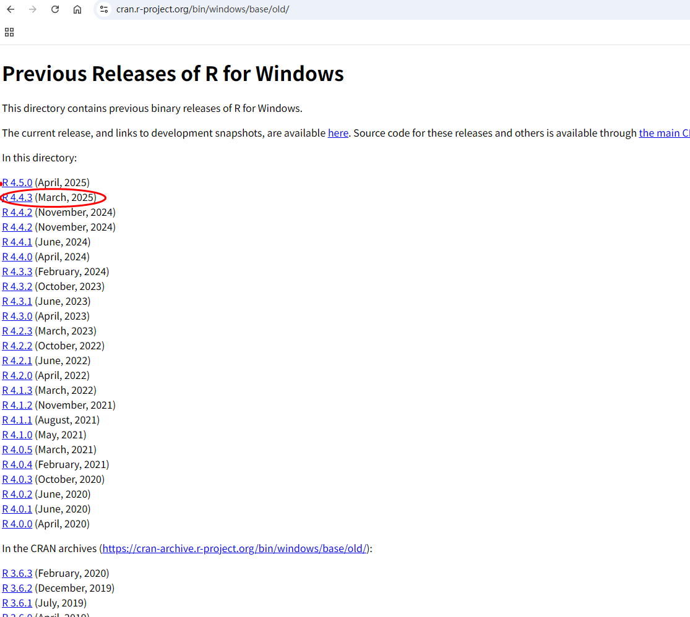
  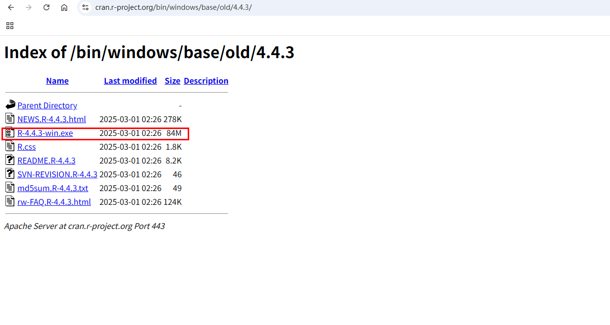

- 安装对应的RTOOLS
  - 下载地址：[https://cran.r-project.org/bin/windows/Rtools](https://cran.r-project.org/bin/windows/Rtools)
  
  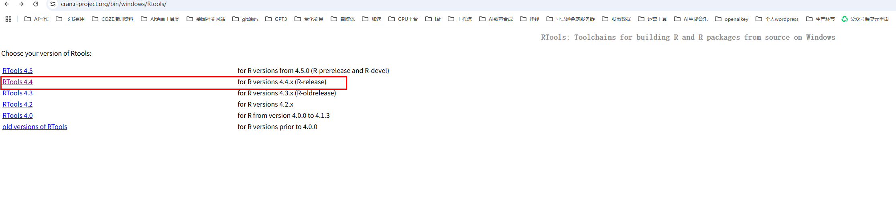
  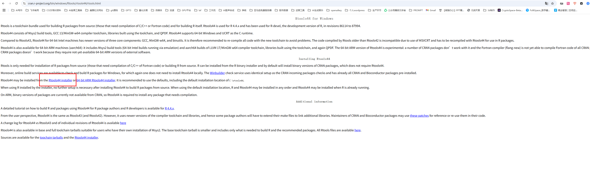
  
  > **注意**：安装时 勾选 Add to PATH。

### 1.2 RStudio
- 下载地址：[https://posit.co/downloads/](https://posit.co/downloads/)，下载桌面版
  
  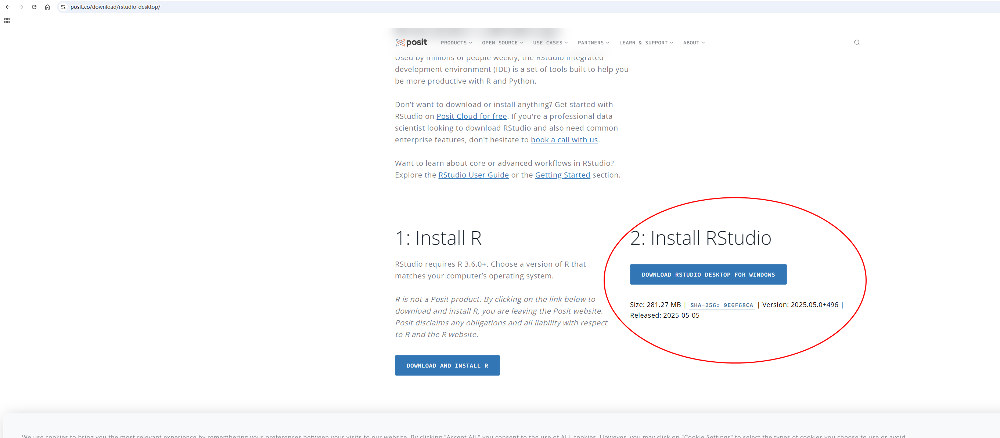

### 1.3 项目代码
- 项目地址：[https://github.com/Zaoqu-Liu/SurvivalML](https://github.com/Zaoqu-Liu/SurvivalML)
  
  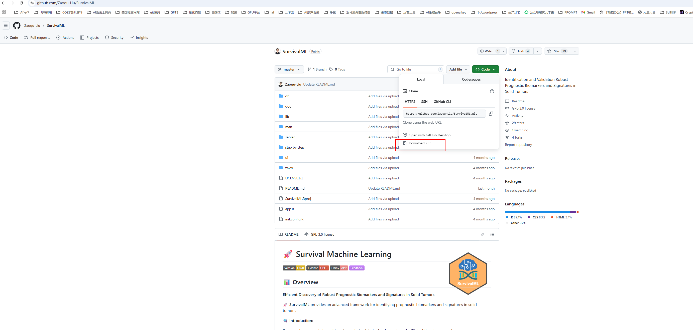

---

## 2. 安装步骤

### 2.1 基础安装
1. 解压项目
   
   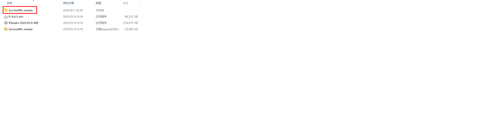

2. 安装R语言和运行平台RStudio
   
   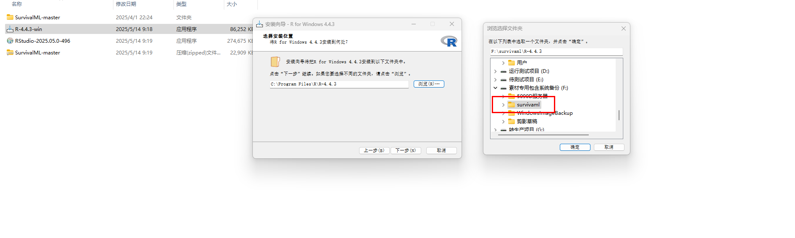
   

3. 替换配置文件
   
   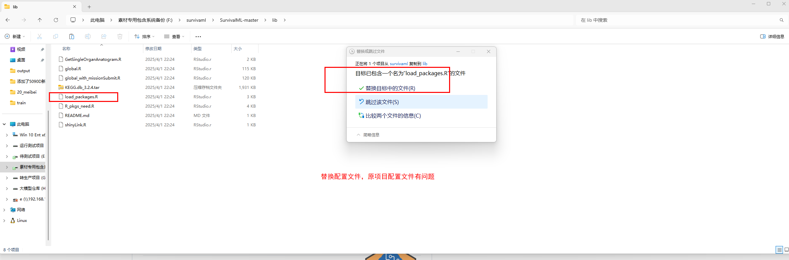

### 2.2 启动RStudio
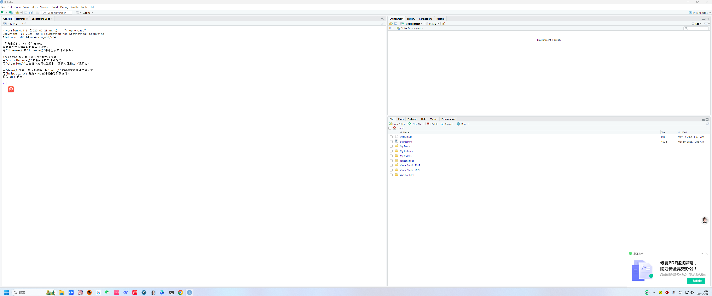

### 2.3 运行程序
1. 导入主程序点击run
   
   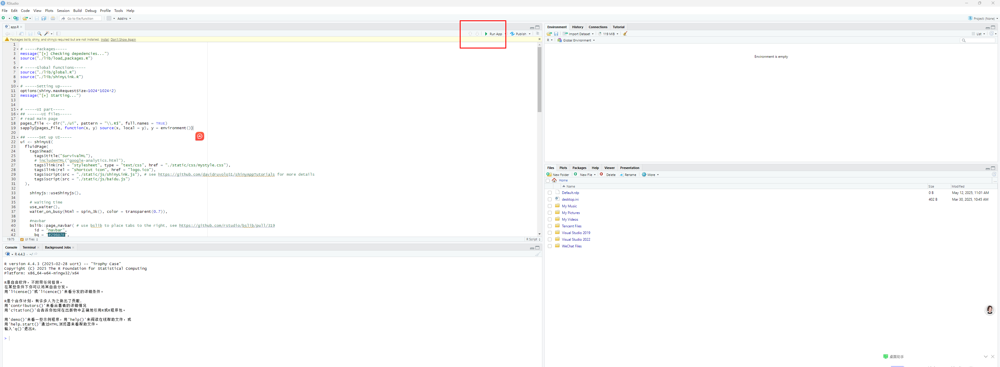

2. 第一次是安装依赖，等依赖安装好了
   
   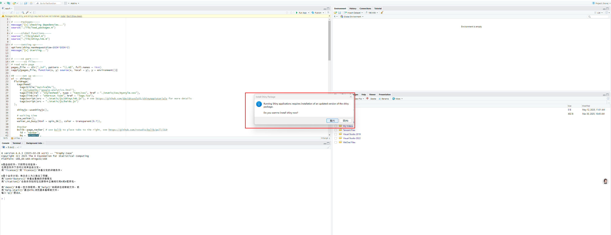

---

## 3. 数据集下载

### 3.1 注册Synapse账号
1. 访问 [https://www.synapse.org/](https://www.synapse.org/)
   > **注意**：注册登录，全程要开梯子

### 3.2 下载数据集
1. 找到数据集地址：[https://www.synapse.org/Synapse:syn58922557](https://www.synapse.org/Synapse:syn58922557)
   
   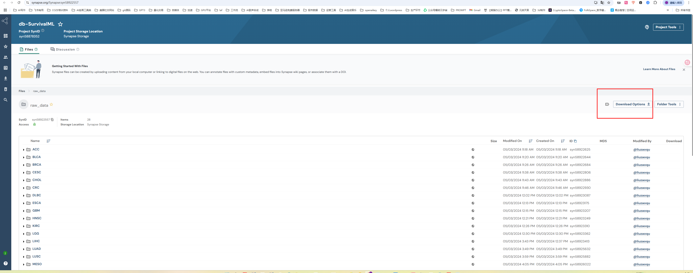
   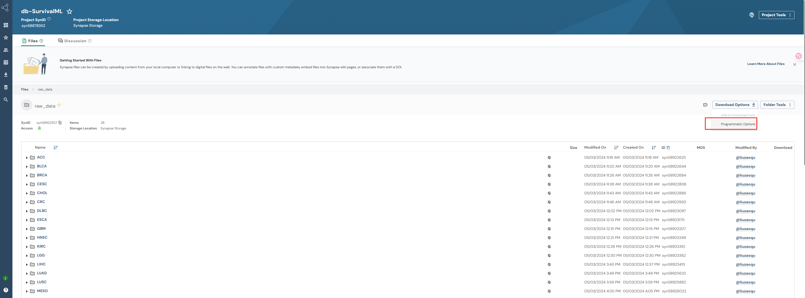

2. 选择批量下载
   - 先安装批量下载工具
   ```bash
   pip install synapseclient
   synapse login -u 您的用户名 -p 您的密码  # 就是前面数据集网站的token
   ```
   
   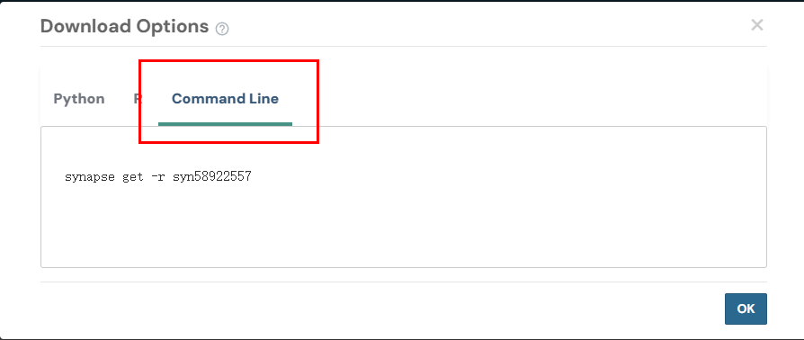
   
   - 执行下载命令
   ```bash
   synapse get -r syn58922557
   ```
   
   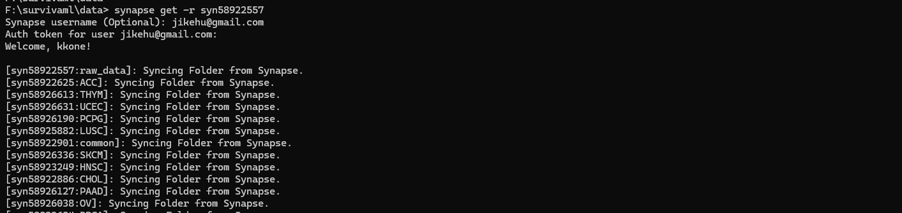

3. 获得批量下载的token
   
   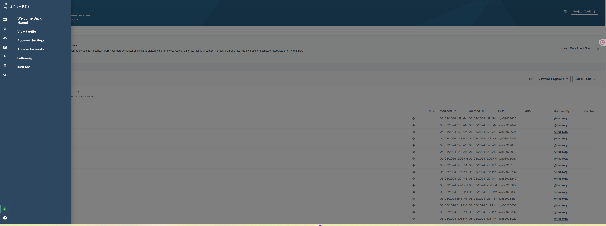
   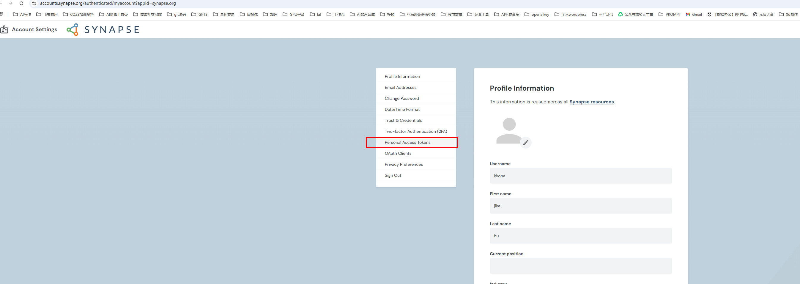
   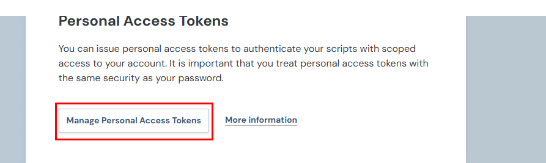
   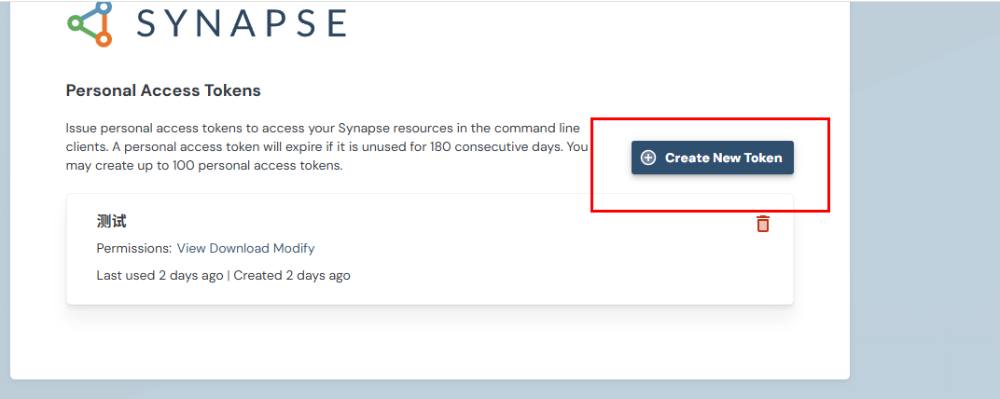
   
   
